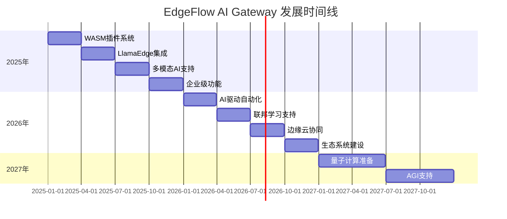

# EdgeFlow AI Gateway 2025-2027 技术路线图总结

## 🎯 愿景声明

**将EdgeFlow打造成为下一代边缘AI基础设施的领导者，通过WebAssembly和LlamaEdge技术，实现高性能、安全、可扩展的AI网关平台。**

## 📊 当前状态 vs 未来目标

### 现状 (2025年1月)
```
✅ 基础反向代理功能
✅ 插件系统架构 (原生Rust插件)
✅ AI路由和聚合
✅ 基础安全功能
✅ Docker集成
✅ 性能优化
```

### 2025年目标
```
🎯 WebAssembly插件生态
🎯 LlamaEdge边缘推理
🎯 多模态AI支持
🎯 企业级功能完善
🎯 100+ WASM插件
🎯 10万QPS性能
```

### 2027年愿景
```
🚀 边缘AI基础设施标准
🚀 全球开发者生态
🚀 量子计算准备
🚀 AGI支持能力
🚀 行业技术领导者
```

## 🗓️ 关键里程碑时间线



## 🏗️ 技术架构演进

### 当前架构 (v0.6.0)
```
┌─────────────────┐
│   HTTP Client   │
└─────────┬───────┘
          │
┌─────────▼───────┐
│  EdgeFlow Gateway │
│  ┌───────────┐  │
│  │  Plugins  │  │ ◄── Rust原生插件
│  └───────────┘  │
│  ┌───────────┐  │
│  │  Routing  │  │
│  └───────────┘  │
└─────────┬───────┘
          │
┌─────────▼───────┐
│   Upstream API  │
└─────────────────┘
```

### 2025年目标架构
```
┌─────────────────┐
│   Multi-Modal   │
│     Client      │
└─────────┬───────┘
          │
┌─────────▼───────┐
│  EdgeFlow Gateway │
│  ┌───────────┐  │
│  │WASM Plugin│  │ ◄── WebAssembly插件生态
│  │ Ecosystem │  │
│  └───────────┘  │
│  ┌───────────┐  │
│  │LlamaEdge  │  │ ◄── 边缘AI推理引擎
│  │ Runtime   │  │
│  └───────────┘  │
│  ┌───────────┐  │
│  │Intelligent│  │ ◄── AI驱动的智能路由
│  │ Routing   │  │
│  └───────────┘  │
└─────────┬───────┘
          │
┌─────────▼───────┐
│ Edge + Cloud AI │
└─────────────────┘
```

### 2027年愿景架构
```
┌─────────────────────────────────────┐
│        AI Application Layer         │
│  ┌─────────┐ ┌─────────┐ ┌─────────┐│
│  │   AGI   │ │ Quantum │ │ Neural  ││
│  │ Agents  │ │   AI    │ │Networks ││
│  └─────────┘ └─────────┘ └─────────┘│
└─────────────┬───────────────────────┘
              │
┌─────────────▼───────────────────────┐
│      EdgeFlow AI Infrastructure       │
│  ┌─────────────────────────────────┐│
│  │    Global Plugin Ecosystem     ││ ◄── 全球插件市场
│  └─────────────────────────────────┘│
│  ┌─────────────────────────────────┐│
│  │   Federated Learning Network   ││ ◄── 联邦学习网络
│  └─────────────────────────────────┘│
│  ┌─────────────────────────────────┐│
│  │  Edge-Cloud Orchestration      ││ ◄── 边缘云编排
│  └─────────────────────────────────┘│
└─────────────┬───────────────────────┘
              │
┌─────────────▼───────────────────────┐
│    Distributed AI Infrastructure    │
└─────────────────────────────────────┘
```

## 🚀 核心技术突破点

### 1. WebAssembly插件生态 (2025 Q1)
**技术突破**:
- 高性能WASM运行时集成
- 多语言插件SDK
- 安全沙箱隔离
- 热加载机制

**预期影响**:
- 插件开发门槛降低90%
- 插件执行性能接近原生
- 多租户安全隔离
- 社区生态快速发展

### 2. LlamaEdge边缘推理 (2025 Q2)
**技术突破**:
- WasmEdge + LLM深度集成
- GPU加速边缘推理
- 模型量化和优化
- 智能模型管理

**预期影响**:
- 推理延迟降低到10ms以下
- 边缘部署成本降低70%
- 支持50+主流AI模型
- 实现真正的边缘AI

### 3. 多模态AI统一处理 (2025 Q3)
**技术突破**:
- 文本、图像、音频、视频统一API
- 流式多模态处理
- 跨模态任务编排
- 智能格式转换

**预期影响**:
- 支持10+模态类型
- 实时多媒体处理
- 统一开发体验
- 降低集成复杂度

### 4. AI驱动的自动化 (2026 Q1)
**技术突破**:
- 基于AI的异常检测
- 自适应性能优化
- 智能资源调度
- 预测性维护

**预期影响**:
- 运维成本降低50%
- 系统可用性提升到99.99%
- 自动化程度达到90%
- 人工干预减少80%

## 📈 关键性能指标 (KPI)

### 技术指标
| 指标 | 2025年目标 | 2026年目标 | 2027年目标 |
|------|------------|------------|------------|
| QPS处理能力 | 100K | 500K | 1M |
| P99延迟 | <50ms | <20ms | <10ms |
| 插件数量 | 100+ | 500+ | 1000+ |
| 支持模型数 | 50+ | 200+ | 500+ |
| 边缘节点数 | 100+ | 1000+ | 10000+ |

### 生态指标
| 指标 | 2025年目标 | 2026年目标 | 2027年目标 |
|------|------------|------------|------------|
| 开发者数量 | 10K | 50K | 200K |
| 企业用户 | 1K | 5K | 20K |
| 社区贡献者 | 100 | 500 | 2000 |
| GitHub Stars | 10K | 50K | 100K |
| 下载量 | 100K | 1M | 10M |

### 商业指标
| 指标 | 2025年目标 | 2026年目标 | 2027年目标 |
|------|------------|------------|------------|
| 市场份额 | 5% | 20% | 40% |
| 收入增长 | - | 500% | 1000% |
| 合作伙伴 | 10 | 100 | 500 |
| 认证插件 | 50 | 200 | 1000 |

## 🎯 竞争优势分析

### 技术优势
1. **性能领先**: 基于Rust+Pingora的极致性能
2. **AI原生**: 专为AI工作负载设计和优化
3. **边缘优先**: 天然支持边缘计算场景
4. **WASM生态**: 领先的WebAssembly插件系统
5. **开源开放**: 完全开源，社区驱动

### 差异化特性
1. **LlamaEdge集成**: 业界首个深度集成LlamaEdge的网关
2. **多模态统一**: 统一处理所有AI模态的能力
3. **智能自动化**: AI驱动的自动化运维
4. **联邦学习**: 支持分布式AI训练和推理
5. **量子准备**: 为下一代计算技术做准备

## 🛡️ 风险缓解策略

### 技术风险
- **WASM性能**: 建立性能基准，准备原生备选方案
- **LlamaEdge依赖**: 与上游团队密切合作，建立技术伙伴关系
- **AI模型兼容**: 建立模型适配层，支持多种格式
- **安全漏洞**: 建立安全审计流程，定期安全评估

### 市场风险
- **竞争加剧**: 建立技术护城河，快速迭代创新
- **标准变化**: 参与标准制定，保持架构灵活性
- **用户需求**: 建立用户反馈机制，快速响应需求
- **技术债务**: 建立重构计划，保持代码质量

## 🎉 成功愿景

### 2025年：边缘AI基础设施
- 成为边缘AI网关的首选解决方案
- 建立活跃的开发者社区
- 实现技术和商业的双重成功

### 2026年：智能化AI平台
- 成为AI基础设施的重要组成部分
- 推动边缘AI技术的普及和应用
- 建立完整的产业生态链

### 2027年：下一代AI基础设施
- 成为AI基础设施的行业标准
- 引领下一代AI技术的发展方向
- 为人类AI时代做出重要贡献

---

**路线图版本**: v1.0  
**制定时间**: 2025年1月  
**下次更新**: 2025年4月  
**执行团队**: EdgeFlow核心开发团队
